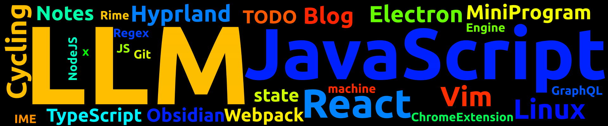

# Blog

    
    

    

    

## 前端

[2篇]

- 2024-03-24 [使用 Umi 开发 Chrome 扩展](https://github.com/lei4519/Blog/issues/37)
- 2024-03-24 [使用 Electron + Vue3 + TS 实现定时提醒休息软件](https://github.com/lei4519/Blog/issues/36)

