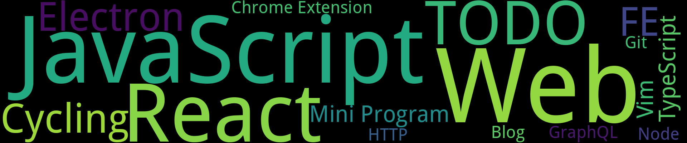

    
    

- [FMP，但中后台](./65) -- 2024-04-10
- [骑行和跑步训练的差异性](./64) -- 2024-03-28
- [Vim ESC 键的解决方案](./54) -- 2024-03-25
- [终端的异步状态管理](./59) -- 2024-03-25
- [dotfiles](./62) -- 2024-03-25
- [Tokenize UI](./61) -- 2024-03-05
- [React Server Component](./55) -- 2024-01-03
- [JS Engine](./57) -- 2024-01-03
- [漫谈 GraphQL](./56) -- 2023-10-27
- [极化训练，为什么要多骑二区（有氧）？](./63) -- 2023-06-18
- [TS 类型编程](./60) -- 2023-02-03
- [模块联邦微前端思考](./49) -- 2022-11-11
- [JS 实现流式打包下载](./53) -- 2021-11-25
- [对 React Hooks 的理解](./58) -- 2021-10-21
- [玩转 TS - 实现 dva 的完整类型推导](./46) -- 2021-06-08
- [React渲染流程](./50) -- 2021-05-06
- [Rxjs 操作符快速入门](./52) -- 2021-03-01
- [使用 Umi 开发 Chrome 扩展](./37) -- 2021-01-05
- [使用Electron + Vue3 + Ts 实现定时提醒休息软件](./36) -- 2020-12-19
- [给原生小程序安排上Composition API](./42) -- 2020-12-18
- [小程序框架原理总结](./43) -- 2020-12-18
- [Electron 进程通信](./39) -- 2020-12-10
- [child_process spawn 模块详解](./44) -- 2020-12-08
- [事件循环 - JS 是怎么运行的？](./47) -- 2020-10-02
- [Git Book 笔记](./40) -- 2020-09-14
- [HTTP 2](./41) -- 2020-06-28
- [Vuepress 博客搭建](./38) -- 2020-06-07
- [PC 端 REM 布局 - 非 Chrome 浏览器字号小于 12px 的解决方案](./45) -- 2020-03-01
- [使用IntersectionObserver实现图片懒加载](./48) -- 2020-01-31
- [正则表达式](./51) -- 2020-01-31
