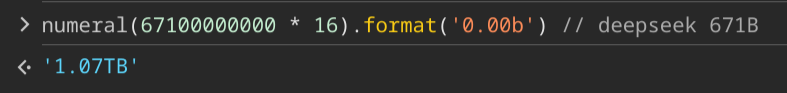
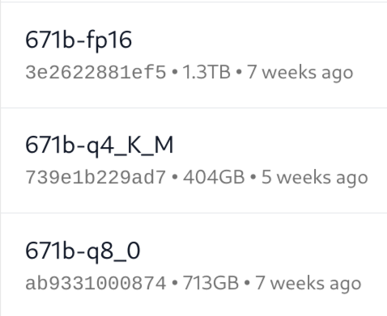
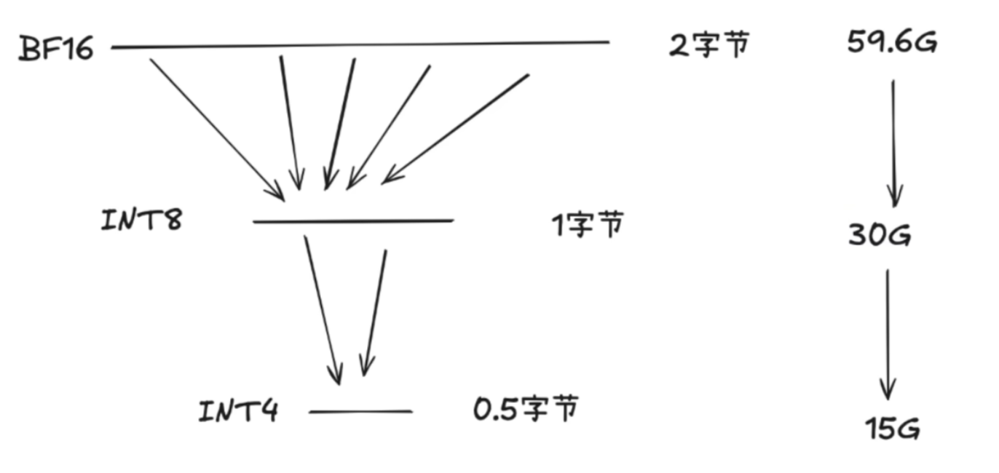
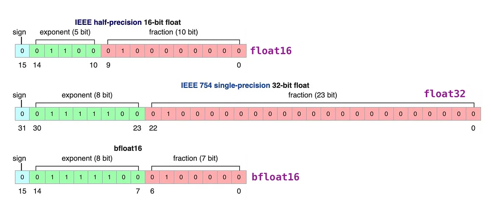
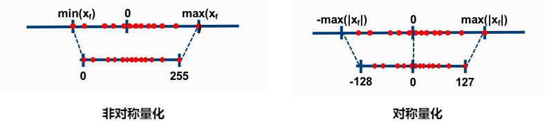
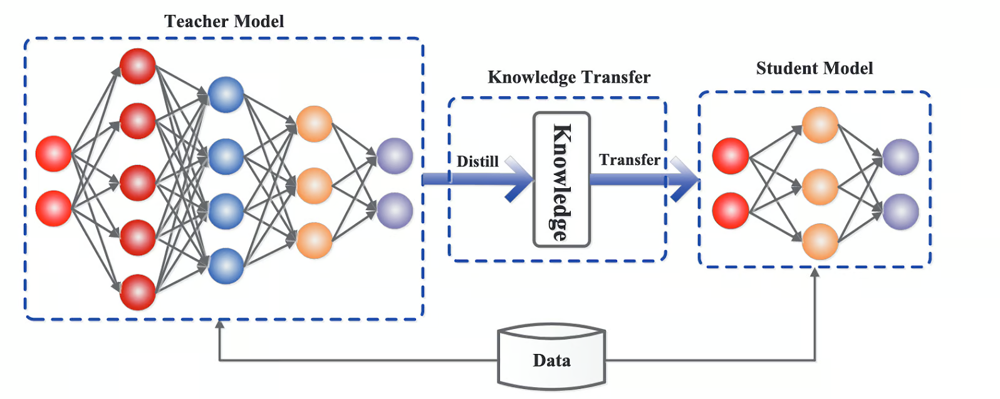

以 deepseek 为例，671B 参数，每个参数使用 fp16 格式

整个模型大概是 1TB 左右的大小

或者直接去 Ollama 看 [Tags · deepseek-r1](https://ollama.com/library/deepseek-r1/tags) 👇

将模型的大小 * `1.2 ~ 2`，大概就可以得到运行模型所需要的内存/显存
- 中间计算、缓存等

## 量化

模型量化是一种通过减少模型参数和计算表示精度来压缩模型的技术。其主要目的是将浮点数参数转换为低精度整数（如 8 位或更低），从而减少存储需求和计算成本。量化过程通常分为以下几种：

1. **后训练量化**  ：在模型训练完成后进行量化，通过统计分析确定最佳的量化比特数，并对权重和激活值进行量化。

2. **量化感知训练**  ：在训练过程中加入量化噪声，使模型在训练阶段就适应低精度表示，从而提高量化后的性能。

3. **混合精度训练**  ：结合不同精度的数据类型进行训练，以平衡精度和计算效率。

量化的主要优点是能够在保持较高精度的同时显著减少模型的存储和计算需求，因此也非常适合用于边缘设备和实时应用。
 

## 蒸馏

模型蒸馏是一种知识迁移的方法，其核心思想是将一个大型、性能较好的“教师模型”（Teacher Model）的知识迁移到一个小型、更高效的“学生模型”（Student Model）中。通过这种方式，学生模型可以在保持较高准确性和泛化能力的同时，减少参数数量和计算复杂度。具体来说，蒸馏过程通常包括以下几个步骤：

1. **训练教师模型**：首先训练一个大型的、性能较好的模型作为教师模型。

2. **生成软标签**：利用教师模型的输出（通常是概率分布）作为软标签，而不是直接使用硬标签。

3. **训练学生模型**：使用这些软标签来训练学生模型，使其能够模仿教师模型的行为。

4. **优化损失函数**：在训练过程中，通常会结合学生模型自身的损失和蒸馏损失，以确保学生模型不仅学习到输入数据的特征，还能捕捉到教师模型的“隐含知识”。

